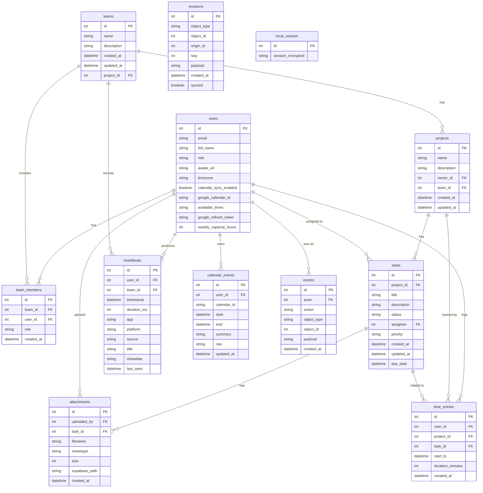
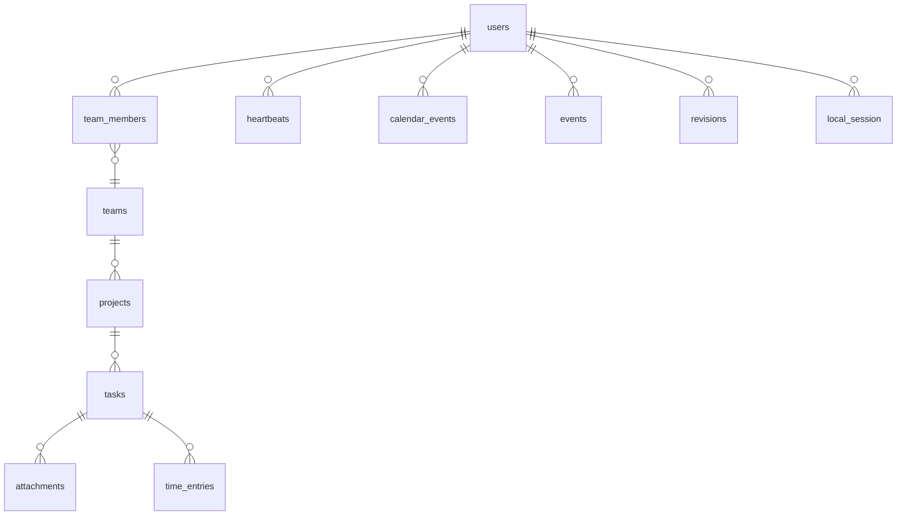

# 🧮 Data Model & Relationships (ASCII ERD)

---

## 🔗 Relationship Summary

| Entity            | Connected To                                                                                                  | Relationship                  |
|-------------------|---------------------------------------------------------------------------------------------------------------|-------------------------------|
| **users**         | `team_members`, `projects`, `tasks`, `attachments`, `heartbeats`, `time_entries`, `calendar_events`, `events` | One-to-many                   |
| **teams**         | `team_members`, `projects`, `heartbeats`                                                                      | One-to-many                   |
| **projects**      | `tasks`, `teams`, `time_entries`                                                                              | One-to-many                   |
| **tasks**         | `attachments`, `time_entries`                                                                                 | One-to-many                   |
| **heartbeats**    | `users`, `teams`                                                                                              | Many-to-one                   |
| **revisions**     | (all major entities)                                                                                          | Tracks changes                |
| **local_session** | none                                                                                                          | Device-level auth persistence |

---

## 📚 Data Schema Overview

### 🧩 Core Entities

| Entity          | 🔗 Relations                                                                                          | 🧠 Description                                                                                |
|:----------------|:------------------------------------------------------------------------------------------------------|:----------------------------------------------------------------------------------------------|
| 🧑‍💼 **users** | ↔ `team_members`, `projects`, `tasks`, `attachments`, `heartbeats`, `time_entries`, `calendar_events` | Central identity — represents workspace members. Handles auth, Google sync, and availability. |
| 👥 **teams**    | ↔ `team_members`, `projects`, `heartbeats`                                                            | Logical grouping of users. Each team can own multiple projects.                               |
| 🧱 **projects** | ↔ `teams`, `tasks`, `time_entries`                                                                    | Represents a single workstream or deliverable; owned by a team and user.                      |
| ✅ **tasks**     | ↔ `projects`, `users`, `attachments`, `time_entries`                                                  | Atomic unit of work. Tracks progress, assignees, due dates, and priorities.                   |

---

### 👷 Collaboration & Structure

| Entity                 | 🔗 Relations       | 🧠 Description                                                        |
|:-----------------------|:-------------------|:----------------------------------------------------------------------|
| 🧩 **team_members**    | ↔ `teams`, `users` | Maps users to teams with role-based access (`admin`, `member`, etc.). |
| 📎 **attachments**     | ↔ `tasks`, `users` | File uploads for task-related documents, stored via Supabase.         |
| 📅 **calendar_events** | ↔ `users`          | External or synced calendar entries (Google Calendar integration).    |

---

### ⚙️ Activity & Analytics

| Entity              | 🔗 Relations                   | 🧠 Description                                                                                                                          |
|:--------------------|:-------------------------------|:----------------------------------------------------------------------------------------------------------------------------------------|
| 🔥 **heartbeats**   | ↔ `users`, `teams`             | Continuous activity pings from desktop apps & extensions. Used for real-time presence, app usage analytics, and user activity heatmaps. |
| ⏱️ **time_entries** | ↔ `users`, `projects`, `tasks` | Tracks duration of work sessions, feeding productivity analytics and reporting.                                                         |
| 🧾 **events**       | ↔ `users`, all entities        | Audit log of user-triggered actions (task updates, file uploads, etc.).                                                                 |
| 🧬 **revisions**    | ↔ `tasks`, `projects`, `teams` | Sync history and offline-first data change tracking for conflict resolution.                                                            |

---

### 🧰 System Tables

| Entity               | 🔗 Relations | 🧠 Description                                                                 |
|:---------------------|:-------------|:-------------------------------------------------------------------------------|
| 🔑 **local_session** | —            | Local secure storage for encrypted session tokens (per device).                |
| 🗃️ **indexes**      | —            | Performance-optimized indices for heartbeat queries (timestamp, user_id, app). |

---

## 🧭 ER Model (Quick Visual)

---

## 🪄 Design Notes

- Indexed high-volume tables: `heartbeats`, `time_entries`, `tasks`
- All timestamps are stored as UNIX epoch (ms) for cross-platform consistency
- Sync-safe — every entity can be tied into the **revision log** for offline merge
- Optimized for Supabase real-time mirroring (via UUID PKs and `updated_at` triggers)
